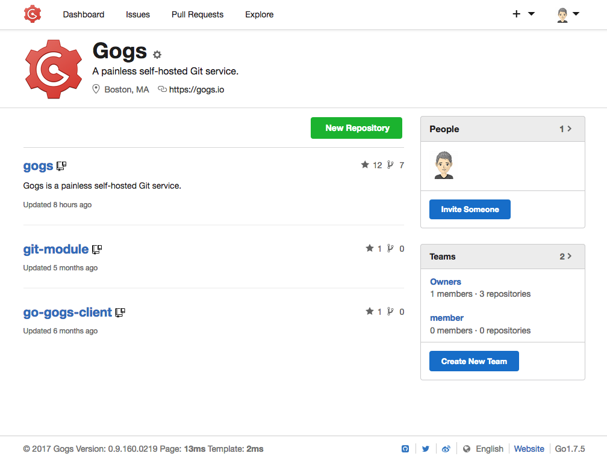

<!--
Nota bene : ce README est automatiquement généré par <https://github.com/YunoHost/apps/tree/master/tools/readme_generator>
Il NE doit PAS être modifié à la main.
-->

# Gogs pour YunoHost

[](https://dash.yunohost.org/appci/app/gogs)  

[](https://install-app.yunohost.org/?app=gogs)

*[Lire le README dans d'autres langues.](./ALL_README.md)*

> *Ce package vous permet d’installer Gogs rapidement et simplement sur un serveur YunoHost.*  
> *Si vous n’avez pas YunoHost, consultez [ce guide](https://yunohost.org/install) pour savoir comment l’installer et en profiter.*

## Vue d’ensemble

Gogs (Go Git Service) est une forge multiplateforme basée sur git écrite en Go. Sa particularité est d’être léger et pouvant fonctionner sur carte ARM, ce qui fait qu’il est adapté à l’auto-hébergement. Gogs a une interface web similaire à celle de GitHub. 


**Version incluse :** 0.13.0~ynh3

**Démo :** <https://try.gogs.io/user/login>

## Captures d’écran



## Documentations et ressources

- Site officiel de l’app : <http://gogs.io>
- Documentation officielle de l’admin : <https://gogs.io/docs>
- Dépôt de code officiel de l’app : <https://github.com/gogs/gogs>
- YunoHost Store : <https://apps.yunohost.org/app/gogs>
- Signaler un bug : <https://github.com/YunoHost-Apps/gogs_ynh/issues>

## Informations pour les développeurs

Merci de faire vos pull request sur la [branche `testing`](https://github.com/YunoHost-Apps/gogs_ynh/tree/testing).

Pour essayer la branche `testing`, procédez comme suit :

```bash
sudo yunohost app install https://github.com/YunoHost-Apps/gogs_ynh/tree/testing --debug
ou
sudo yunohost app upgrade gogs -u https://github.com/YunoHost-Apps/gogs_ynh/tree/testing --debug
```

**Plus d’infos sur le packaging d’applications :** <https://yunohost.org/packaging_apps>
