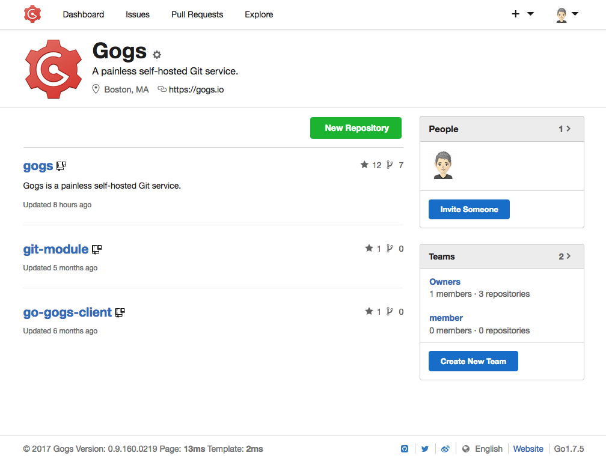

<!--
N.B.: README ini dibuat secara otomatis oleh <https://github.com/YunoHost/apps/tree/master/tools/readme_generator>
Ini TIDAK boleh diedit dengan tangan.
-->

# Gogs untuk YunoHost

[](https://ci-apps.yunohost.org/ci/apps/gogs/)


[](https://install-app.yunohost.org/?app=gogs)

*[Baca README ini dengan bahasa yang lain.](./ALL_README.md)*

> *Paket ini memperbolehkan Anda untuk memasang Gogs secara cepat dan mudah pada server YunoHost.*  
> *Bila Anda tidak mempunyai YunoHost, silakan berkonsultasi dengan [panduan](https://yunohost.org/install) untuk mempelajari bagaimana untuk memasangnya.*

## Ringkasan

Gogs (Go Git Service) is a git-based multiplatform forge written in Go. Its particularity is that it is light and can run on an ARM card, which makes it suitable for self-hosting. Gogs has a web interface similar to that of GitHub.

### Features

- User dashboard, user profile and activity timeline.
- Repository and organization webhooks, including Slack, Discord and Dingtalk.
- Repository Git hooks, deploy keys and Git LFS.
- Repository issues, pull requests, wiki, protected branches and collaboration.
- Migrate and mirror repositories with wiki from other code hosts.
- Web editor for quick editing repository files and wiki.
- Jupyter Notebook and PDF rendering.
- Authentication via SMTP, LDAP.


**Versi terkirim:** 0.13.0~ynh3

**Demo:** <https://try.gogs.io/user/login>

## Tangkapan Layar



## Dokumentasi dan sumber daya

- Website aplikasi resmi: <http://gogs.io>
- Dokumentasi admin resmi: <https://gogs.io/docs>
- Depot kode aplikasi hulu: <https://github.com/gogs/gogs>
- Gudang YunoHost: <https://apps.yunohost.org/app/gogs>
- Laporkan bug: <https://github.com/YunoHost-Apps/gogs_ynh/issues>

## Info developer

Silakan kirim pull request ke [`testing` branch](https://github.com/YunoHost-Apps/gogs_ynh/tree/testing).

Untuk mencoba branch `testing`, silakan dilanjutkan seperti:

```bash
sudo yunohost app install https://github.com/YunoHost-Apps/gogs_ynh/tree/testing --debug
atau
sudo yunohost app upgrade gogs -u https://github.com/YunoHost-Apps/gogs_ynh/tree/testing --debug
```

**Info lebih lanjut mengenai pemaketan aplikasi:** <https://yunohost.org/packaging_apps>
